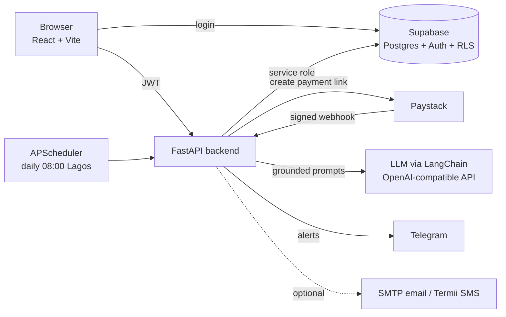

# AI-Powered Invoicing & Cash-Flow Assistant

A proof-of-concept invoicing app for Nigerian small businesses. Create an invoice, get a real Paystack payment link, watch the invoice flip to **paid** automatically when the customer pays, log expenses, and ask an AI assistant plain-English questions about your money, with answers grounded strictly in your own data.

**Live demo:** https://ai-ml-projects-gamma.vercel.app
The demo runs in **Paystack test mode** (no real money moves) on free hosting, so the first load after a quiet period can take up to a minute while the server wakes up.

---

## What it does

| Feature | How it works |
|---|---|
| **Invoicing** | Pick a customer, add line items, and the server computes the total (the browser is never trusted with money). Each invoice gets a Paystack checkout link. |
| **Automatic payment confirmation** | Paystack calls a signed webhook when a payment succeeds and the invoice becomes `paid` with no manual step. Signatures are verified and payments are recorded idempotently, so duplicate deliveries cannot double-count. A "Check payment" button is available as a fallback. |
| **Overdue tracking** | A daily job (08:00 Lagos time, plus a catch-up run at startup) marks late invoices `overdue` and sends the owner a Telegram digest. A red dashboard banner appears regardless of Telegram. |
| **Customer reminders** | A manual, confirmed, rate-limited "Remind customer" action sends an email and/or SMS with the amount owed and a pay link. Every send is logged. |
| **Expenses** | Fast expense logging with a fixed category list (rent, transport, supplies, utilities, salaries, other). |
| **Summary** | Revenue, expenses, net cash, average invoice value, paid vs overdue counts, and average days-to-pay per customer, for the current week or month in Lagos time. |
| **Ask** | Ask questions like "Which customers are slow payers?" or "Am I in the red or green this week?". The model answers only from the numbers it is given and says so when it does not have the data. |
| **Insights** | One click generates 2 to 3 specific observations comparing this period with the previous one (for example, a good customer's payments getting slower). |

## The three rules that make it trustworthy

1. **Webhook signatures are always verified, and payments are idempotent.** An unsigned or repeated notification can never change your books.
2. **Money is computed once, in SQL.** The dashboard and the AI both read the same numbers, so they cannot disagree.
3. **The AI only reasons over data it is handed.** Every prompt embeds the computed figures and forbids estimating. A safety check flags any money figure in an answer that does not appear in the data, and the UI tells the owner to double-check flagged answers.

## Architecture



| Part | Technology |
|---|---|
| Frontend | React, Vite, TypeScript (`frontend/`), hosted on Vercel |
| Backend | Python, FastAPI, pydantic, APScheduler (`backend-py/`), hosted on Render |
| Database and auth | Supabase Postgres with Row Level Security. Money logic lives in SQL functions (`supabase/migrations/`) |
| Payments | Paystack (test mode) |
| AI | LangChain `ChatOpenAI` against any OpenAI-compatible endpoint. Currently Groq with `openai/gpt-oss-120b` |
| Notifications | Telegram (owner alerts), SMTP email and Termii SMS (customer reminders, optional) |

Security notes: Row Level Security isolates each business's data, and the browser cannot write invoices or call payment functions directly. Only the backend, using the service-role key, does that. An included SQL test proves the isolation (see Testing).

## Run it locally

**Prerequisites:** Python 3.13, Node.js, a Supabase project, a Paystack account (test keys), and a free Groq API key. Optionally the Supabase CLI and ngrok.

1. **Database.** From the project root, apply the migrations:
   ```bash
   supabase link --project-ref YOUR-PROJECT-REF
   supabase db push
   ```
2. **Backend.**
   ```bash
   cd backend-py
   python -m venv .venv
   # Windows: .venv\Scripts\activate    macOS/Linux: source .venv/bin/activate
   pip install -r requirements.txt
   ```
   Create `backend-py/.env` using the variables in the table below, then run:
   ```bash
   uvicorn app.main:app --reload --port 4000
   ```
   Check `http://localhost:4000/health`.
3. **Frontend.**
   ```bash
   cd frontend
   npm install
   ```
   Create `frontend/.env`:
   ```
   VITE_SUPABASE_URL=https://YOUR-PROJECT.supabase.co
   VITE_SUPABASE_ANON_KEY=your-anon-key
   VITE_API_BASE_URL=http://localhost:4000
   ```
   Then `npm run dev` and open the address it prints (normally `http://localhost:5173`).
4. **Optional demo data.** Sign up in the app, then run `supabase/seed_demo.sql` in the Supabase SQL editor (edit the email at the top first, and run it once). `supabase/cleanup_demo.sql` removes it.

Settings are read once at startup, so restart the backend after editing `.env`.

### Backend environment variables

| Variable | Required | Purpose |
|---|---|---|
| `SUPABASE_URL` | yes | Your Supabase project URL |
| `SUPABASE_SERVICE_ROLE_KEY` | yes | Server-only key. Never put it in the frontend |
| `PAYSTACK_SECRET_KEY` | yes | Paystack test secret key (`sk_test_...`). Also verifies webhook signatures |
| `LLM_API_KEY` | for AI | Key for your LLM provider (free key at console.groq.com) |
| `LLM_BASE_URL` | no | Default `https://api.groq.com/openai/v1` |
| `LLM_MODEL` | no | Model ID your provider offers. Check your provider's model list |
| `AI_REQUESTS_PER_10MIN` | no | AI rate limit, default 20 |
| `FRONTEND_ORIGIN` | no | Allowed browser origin(s), comma-separated. Default `http://localhost:5173` |
| `BUSINESS_TIMEZONE` | no | Default `Africa/Lagos`. Used for every "today / this week" boundary |
| `TELEGRAM_BOT_TOKEN`, `TELEGRAM_CHAT_ID` | no | Owner alerts. Token looks like `123456789:AAF...` |
| `REMINDER_CRON`, `REMINDER_INTERVAL_HOURS`, `DISABLE_SCHEDULER` | no | Scheduler tuning |
| `SMTP_HOST`, `SMTP_PORT`, `SMTP_USER`, `SMTP_PASSWORD`, `SMTP_FROM`, `SMTP_STARTTLS` | no | Customer email (STARTTLS on port 587) |
| `TERMII_API_KEY`, `TERMII_SENDER_ID`, `TERMII_BASE_URL` | no | Customer SMS via Termii |
| `CUSTOMER_REMINDER_COOLDOWN_HOURS` | no | Default 24 |

Every optional service is skipped cleanly when it is not configured.

### Testing payments and webhooks locally

Paystack cannot reach `localhost`, so expose your backend with a tunnel (for example `ngrok http 4000`) and set the **Test Webhook URL** in the Paystack dashboard to `https://<your-tunnel>/webhooks/paystack`. Or skip the webhook and use the app's **Check payment** button.

Paystack test card: `4084 0840 8408 4081`, any future expiry, CVV `408`.

## Testing

- **Backend:** `cd backend-py && pytest` (66 tests covering webhook signatures, timezones, money handling, reminders, AI grounding and rate limits; external services are mocked).
- **Database isolation:** run `supabase/tests/rls_isolation.sql` in the Supabase SQL editor. "Success. No rows returned" means every check passed, and any failed check raises an error.
- **AI grounding:** ask something that is not in the data, for example "Predict next month's revenue". It should say it does not have that data instead of inventing a number.

## Deployment

| Piece | Host | Key settings |
|---|---|---|
| Backend | Render web service | Root directory `invoicing-poc/backend-py` (this project sits inside a larger repo). Build `pip install -r requirements.txt`. Start `uvicorn app.main:app --host 0.0.0.0 --port $PORT`. Health check `/health`. Set `PYTHON_VERSION` to a full version such as `3.13.7`. Run a **single** worker, because the scheduler and rate limiter are in-process |
| Frontend | Vercel | Root directory `invoicing-poc/frontend`, Vite preset. Set `VITE_SUPABASE_URL`, `VITE_SUPABASE_ANON_KEY`, and `VITE_API_BASE_URL` (the backend address, no trailing slash). These are baked in at build time, so redeploy after changing them |
| Wiring | | Set the backend's `FRONTEND_ORIGIN` to the exact frontend address. Set Supabase **Authentication, URL Configuration** to the frontend address. Set the Paystack webhook to `https://<backend>/webhooks/paystack` |

## Known limits

- **Proof of concept.** One business per owner. No multi-user roles, bank-statement import, open banking, or WhatsApp.
- **Free-tier hosting sleeps.** Idle servers spin down and take about a minute to wake. The startup catch-up run covers a missed daily job, but real daily alerts would need an always-on instance.
- **Email needs SMTP on port 587.** Some free hosts (including Render's free tier) block outbound SMTP. SMS and Telegram use HTTPS and are unaffected.
- **SMS via Termii** needs an approved sender ID and costs credit.
- **Smaller language models** invent numbers more often. Use a large model for demos. The unverified-figures check catches most slips, not all.
- **Test mode only.** Live payments would need live Paystack keys and more hardening.

## Project structure

```
backend-py/        FastAPI app (routers, AI layer, scheduler, notifiers) and tests
frontend/          React + Vite + TypeScript app
supabase/          Migrations, RLS isolation test, demo seed and cleanup scripts
docs/              Architecture guide (PROJECT_GUIDE.md) and per-day design notes
```

Start with `docs/PROJECT_GUIDE.md` for the full walkthrough, and `docs/DEMO_SCRIPT.md` for a five-minute demo path.
